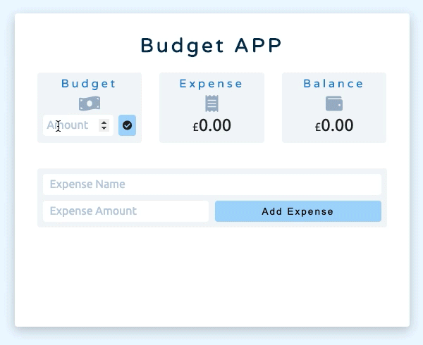
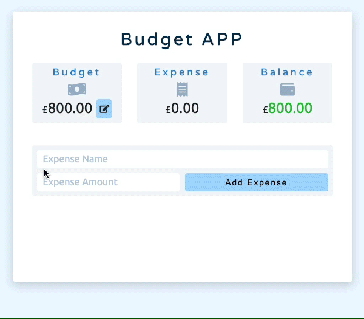
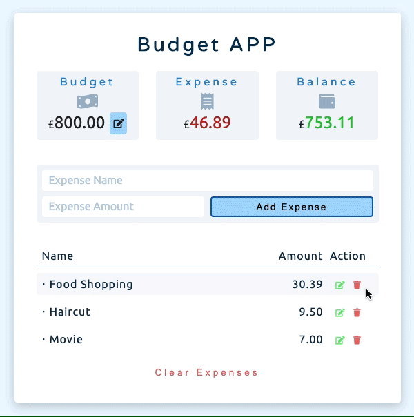

# JavaScript Project_Budget APP

This is an execise inspired by <a href="https://github.com/john-smilga/js-budget-setup">John Smilga</a>.

Live site: https://jasontwuk.github.io/JavaScript-Project_Budget-APP/

Add and edit budget: 

Add and edit expense: 

Remove expense: 

