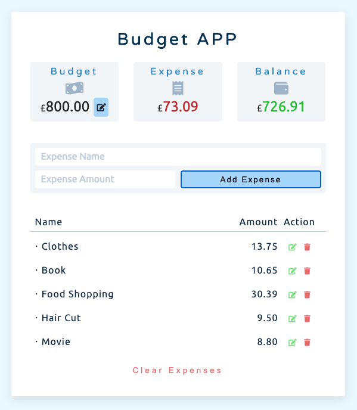

# JavaScript Project_Budget APP

This is a project inspired by <a href="https://github.com/john-smilga/js-budget-setup">John Smilga</a>. I rewrote the JavaScript part on my own after I learnt how to do it. Also, I modified the interface to make it more user-friendly.

Live site: https://jasontwuk.github.io/JavaScript-Project_Budget-APP/

Here is how it looks like: 

