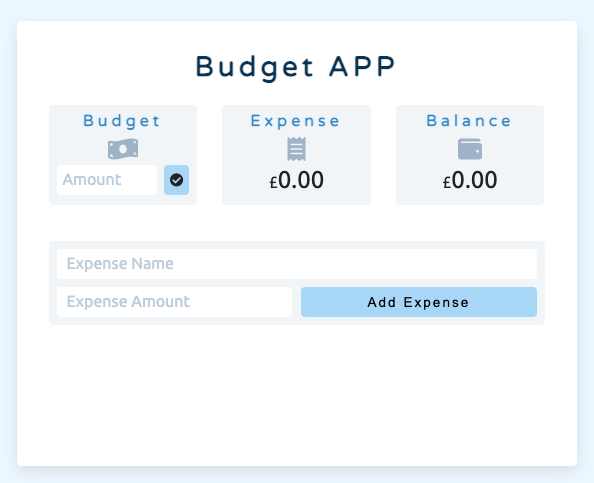

# JavaScript Project_Budget APP

This web application let users set their budgets and keep track of their expenses. Users can edit their budgets and add / delete / modify their expenses at any time. The balance number will turn red to indicate over spending, otherwise it will be green to show the budget is still looking healthy.

This is a project inspired by [John Smilga](https://github.com/john-smilga/js-budget-setup). I rewrote the JavaScript part on my own after I learnt how to do it. Also, I modified the interface to make it more user-friendly.

Live site: https://jasontwuk.github.io/JavaScript-Project_Budget-APP/

#### Used technologies

- HTML5
- CSS3
- Vanilla JS

#### Used resource

- [Font Awesome](https://fontawesome.com/)

Here is how it looks like: 

